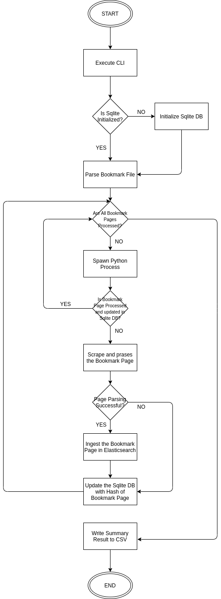

# Problem

As Software Engineers, we frequently bookmark links for great content either for reading it later or solving our problems.

Search Engines that we use, frequently updates the listed articles for our search, hence the search list will be different after a particular interval of time.

Bookmark modules in the popular modern browsers doesn't provide full-text search for the content, so how to search through the contents that is already curated by us for later reference?

There are indeed off the shelf solutions which provides the full-text search for your saved/bookmarked links but they are paid.


# Solution

## Approach

Develop a solution which can provide full text search across your bookmarked links and cen be run by yourself.

## Philosophy

* Use external tools as much as you can.
* Use external software libraries as much as you can.
* The target audience is Software Engineers, hence setup and UX doesn't need to be simplified.


## Tools

* **Python:** It is used to parse, scrape the bookmark links.
* **Elasticsearch:** It is used to store the parsed content and as search engine.
* **Kibana:** It is used as UI to search through the stored content.
* **SQlite3:** It is used to stored the metadata of parsed bookmark links. Redis is a smarter choice and can provide O(1) for metadata lookup against Sqlite3's O(n), but still Sqlite3 was chosen as process of storing/fetching metadata is infrequent and Sqlite3 is not required to be in running state as opposed to Redis, which does save CPU time and Memory.

## Data Flow




## Setup

### Pre-requisite

* Python3
* Docker
* Docker-Compose

### Steps

* Clone this Repository.

* Enable virtual environment

```
$ python3 -m venv venv
```

* Activate the virtual environment

```
$ source venv/bin/activate
```

* Install the Python dependencies

```
$ cd loader
$ pip install -r requirements.txt
```

* Create the `.env` file in docker directory as per your requirement

```
LOCAL_DATA_DIR=/path/to/my/data
```

* Start the Kibana and Elasticsearch

```
$ cd docker
$ docker-compose up -d
```

## Loader CLI


```
$ ./loader.py -h
Usage: loader.py [options]

Options:
  --version             show program's version number and exit
  -h, --help            show this help message and exit
  -s SERVER, --server=SERVER
                        Elasticsearch Host
  -p PORT, --port=PORT  Elasticsearch Port
  -i INDEX, --index=INDEX
                        Elasticsearch Index
  -l LOCATION, --location=LOCATION
                        Location to Bookmarkfile
  -d DATABASE_LOCATION, --database=DATABASE_LOCATION
                        Location to SqliteDB, it will be created if not
                        provided
  -c CPU, --cpu=CPU     Number of CPUs
  -a AGENT, --agent=AGENT
                        User-Agent to use while scraping websites
```

### Example

```
$ ./loader.py -s localhost -p 9200 -i bookmark -l /home/anshul/Documents/boo
kmarks_24_04_2020.html -d /home/anshul/bookmark_data/bookmark.db
```
